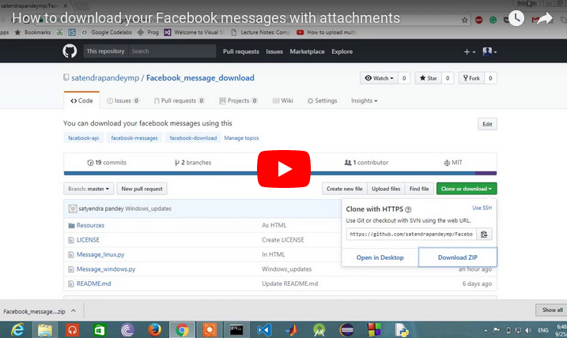

# Facebook_message_download
You can download your facebook messages using this.
Here it's how gonna look.

## For a Person


### Here is how it's gonna look for shared Images --


## Installation
Use following command to install other dependency

```bash
pip install -r requirement.txt
```
and remeber to ***install fbchat 1.0.25 version***, updated versions don't support many features.

### For Linux or Windows

Just run Message_linux.py for Linux and Message_windows.py for Windows, it will download all kind of attachments.

## A helping video for people with other background

[](https://www.youtube.com/watch?v=xW2hpkoaIiM)
